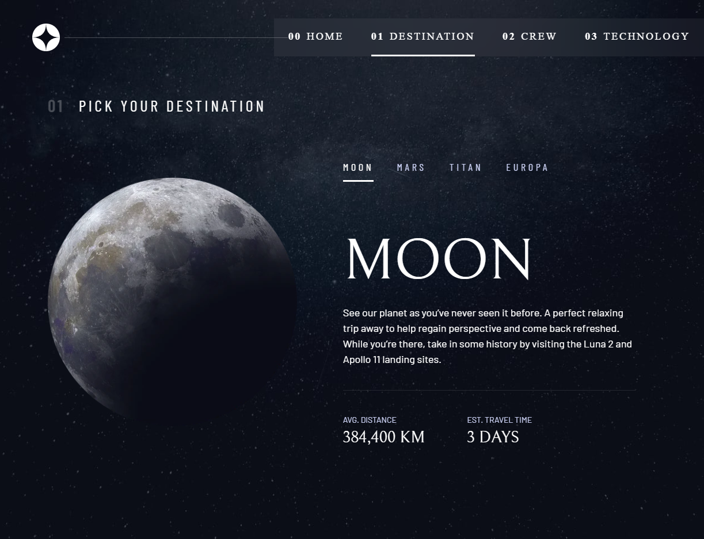

# Frontend Mentor - Space tourism website solution

This is a solution to the [Space tourism website challenge on Frontend Mentor](https://www.frontendmentor.io/challenges/space-tourism-multipage-website-gRWj1URZ3). Frontend Mentor challenges help you improve your coding skills by building realistic projects.

## Table of contents

- [Overview](#overview)
  - [The challenge](#the-challenge)
  - [Screenshot](#screenshot)
  - [Links](#links)
- [My process](#my-process)
  - [Built with](#built-with)
  - [Continued development](#continued-development)
- [Author](#author)
- [Acknowledgments](#acknowledgments)

## Overview

### The challenge

Users should be able to:

- View the optimal layout for each of the website's pages depending on their device's screen size
- See hover states for all interactive elements on the page
- View each page and be able to toggle between the tabs to see new information

### Screenshot



### Links

- Live Site URL: [Add live site URL here](https://trusting-shannon-e163c9.netlify.app)

## My process

Coming up with this project's solution started with the small pieces like the necessary react components for the pages like the main button, the tabs, the dots etc. Afterwards I went on with the Home page. After finishing the Home page, I picked up the Destination page style template after which each destination page is based on. In the destination folder I put the 4 destination pages. This same process was used for the other sections of the site. I employed the React Router library for navigation used in the NavBar and also in the dots and tabs components.

### Built with

- Semantic HTML5 markup
- CSS custom properties
- Flexbox
- CSS Grid
- Mobile-first workflow
- [React](https://reactjs.org/) - JS library
- [Styled Components](https://styled-components.com/) - For styles
- [React Router](https://reactrouter.com/)

### What I learned

Use this section to recap over some of your major learnings while working through this project. Writing these out and providing code samples of areas you want to highlight is a great way to reinforce your own knowledge.

To see how you can add code snippets, see below:

```html
<h1>Some HTML code I'm proud of</h1>
```

```css
.proud-of-this-css {
  color: papayawhip;
}
```

```js
const proudOfThisFunc = () => {
  console.log('🎉');
};
```

### Continued development

In the future I would like to dinamically import the content of each page from a json file, but I was unable to come up with a functional solution that also incorporated the React Router.

## Author

- Frontend Mentor - [@yourusername](https://www.frontendmentor.io/profile/popaclctin)

## Acknowledgments

I would like to thank Kevin Powell for the excellent course on bulding the vanilla build for this project on scrimba.com from which I took inspiration.
